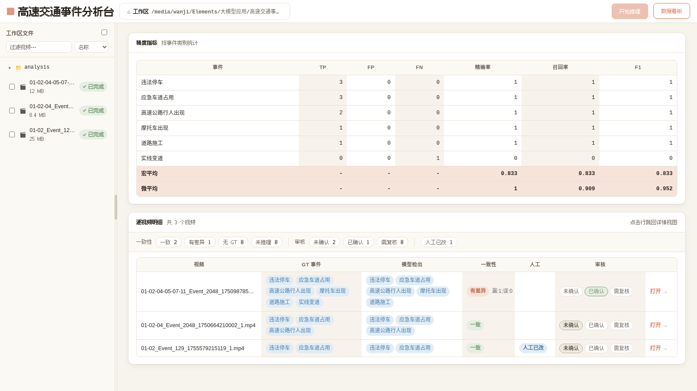
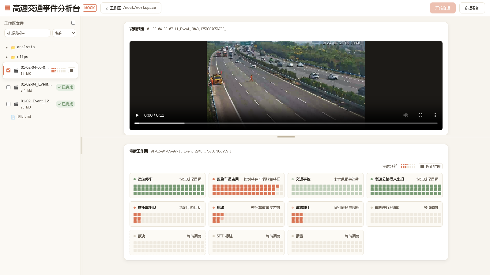

[English](README.md) | [简体中文](README.zh-CN.md)

# Traffic Analyzer

VLM (vision-language model) based traffic event detection for highway surveillance
video: one video clip in, an **11-bit binary event code** plus a structured report
(Markdown / JSON) out — and, with SFT label mode, one **SFT training sample** per
video, editable in the built-in web UI.

**Current version: 5.0.0.**

## Quick Start

### Requirements

- Python 3.10+ (Docker image uses 3.11)
- `ffmpeg` (video decoding; install via your OS package manager)
- `pip install -r requirements.txt` — plus `pip install -r requirements-dev.txt` for tests

### 1. Configure the VLM provider

```bash
cp traffic_analyzer/config/.env.example traffic_analyzer/config/.env
# edit .env: set API key(s) and model(s)
```

LLM settings are read **only from `.env`** (`traffic_analyzer/config/.env`, repo root
`.env` as a legacy fallback) — shell environment variables for provider/key/model are
ignored. Minimal single-provider setup:

```ini
VLM_PROVIDER=anthropic
ANTHROPIC_API_KEY=sk-...
ANTHROPIC_MODEL=claude-sonnet-4-6
```

Optionally check the config before running:

```bash
python3 -m traffic_analyzer validate-config --config-dir ./traffic_analyzer/config
```

### 2. Analyze a video

```bash
python3 -m traffic_analyzer analyze \
  --video ./path/to/video.mp4 \
  --format markdown \
  --output ./output/report.md
```

Without `--output` the report (JSON by default, `--format markdown` for Markdown)
goes to stdout. Useful flags: `--min-frames N` (max frames per VLM call, default 10),
`--sft-label` (also export one SFT training sample per video to `--sft-output-dir`,
default `output/sft_labels`), `--config-dir`, `--log-level`. Full list:
`python3 -m traffic_analyzer analyze --help`.

While analyzing in a terminal, a **rich live progress panel** shows one swimlane per
expert (8 event experts + adjudication + SFT labeling + report); in non-TTY output
(web subprocess, pipes) it degrades to `EXPERT_PROGRESS` marker lines that the web UI
parses instead. Exit codes: `0` success, `1` error, `2` video rejected by the
prefilter (no report file written).

## Web UI

The web UI (FastAPI backend + SPA frontend) is the main interface for inference,
SFT label editing, and dataset review:

```bash
python3 -m traffic_analyzer web            # default http://127.0.0.1:8600
python3 -m traffic_analyzer web --host 0.0.0.0 --port 9000 --workspace ./workspace
```



- **Workspace** — videos and their analysis results live under one workspace folder;
  switch it from the toolbar (or preselect with `--workspace`).
- **Inference** — check one or many videos and start inference; jobs run queued in
  the background. The **expert workshop** panel shows an 11-lane pixel-style
  animation (8 category experts + adjudication + SFT labeling + report) with
  per-lane live progress. A running job can be stopped at any time (SIGTERM, then
  SIGKILL), and a stopped/failed video can be retried with the ↻ button. Jobs run
  the same `analyze` pipeline with `--sft-label`, so every job also produces an SFT
  sample and evidence files.
- **SFT label editing** — per-video result cards show the SFT sample; structured
  **option chips** (closed enums from `event_options.yaml`) stay in sync with the
  description text, and the first manual edit freezes the raw model output as
  `<stem>_raw.json` so human edits are tracked separately.
- **Evidence editing** — a canvas editor for the visual evidence: drag polygon/box
  vertices and edges, saved back to `<stem>_evidence.json`.
- **Data dashboard** — full-page GT-vs-prediction view: per-video consistency
  (consistent / diff / no GT / no results), a three-state review workflow
  (unconfirmed / confirmed / needs_review, persisted to
  `analysis/review_states.json`), live aggregate metrics (per-event precision /
  recall / F1 with macro & micro averages), an "edited by human" badge and filter
  (diffed against the `_raw.json` snapshot), and name search.



## Multi-User Deployment

For a shared server, bind to all interfaces and give each person an account:

```bash
python3 -m traffic_analyzer web --host 0.0.0.0 --port 8600
```

- **Login & 30-day session** — auth turns on automatically once any account exists.
  Users log in at `/login`; the session cookie is valid for 30 days (no re-login in
  that period) and is bound to the login IP. When no account exists, auth is fully
  off and everything works as the single local user.
- **Per-person accounts** — each login is a distinct user; edits record
  `last_edited_by`, and the dashboard/presence show who did what.
- **Presence** — the UI shows who is currently viewing/editing which video (30 s
  heartbeat roster).
- **409 conflict protection** — saving an SFT sample or evidence file is rejected
  with 409 when someone else changed the file since you loaded it (optimistic
  fingerprint check), or while an inference job for that video is queued/running —
  no silent overwrites.

### Managing accounts

Accounts live in `traffic_analyzer/config/users.db`, managed with a CLI (passwords
are prompted interactively if `--password` is omitted):

```bash
python3 scripts/manage_users.py add zhangsan        # create account (prompts for password)
python3 scripts/manage_users.py list                # list all accounts
python3 scripts/manage_users.py passwd zhangsan     # change a password
python3 scripts/manage_users.py remove zhangsan     # delete an account
```

Bootstrap alternative: set `TRAFFIC_ANALYZER_USERS=zhangsan:pass1,lisi:pass2` in
`traffic_analyzer/config/.env`; on first startup the accounts are imported into
`users.db` and the `.env` line is commented out. The session signing key
`TRAFFIC_ANALYZER_SECRET` is auto-generated and appended to `.env` on first use.

### Workspace whitelist

Restrict which directories users may pick as a workspace:

```ini
# traffic_analyzer/config/.env — comma-separated, ~ and relative paths OK
TRAFFIC_ANALYZER_WORKSPACE_DIRS=/data/videos,/srv/datasets
```

With a non-empty list, workspace selection and directory browsing are confined to
those directories and their subdirectories (403 otherwise). **Delete the line (or
leave it empty) and workspaces are unrestricted.**

## Mock Demo Mode

Open the UI with **`?mock=1`** appended (e.g. `http://127.0.0.1:8600/?mock=1`) for a
zero-token demo: real video streaming from the demo clips, a simulated inference
animation in the expert workshop, and real conclusion data (snapshotted from real
runs by `scripts/build_mock_data.py`). A MOCK badge shows in the corner; no VLM
calls are made.

For a scripted looping demo / UI self-test (Playwright, drives every button and
page, screenshots to `output/e2e_screenshots/`):

```bash
python3 scripts/e2e_mock_test.py              # headed browser, loops until Ctrl+C
python3 scripts/e2e_mock_test.py --headless --passes 3 --fast
```

The script starts the web service on 127.0.0.1:8600 itself if needed; when auth is
enabled, provide `E2E_USER` / `E2E_PASS`.

## Configuration Reference

### `traffic_analyzer/config/.env`

| Variable | Default | Description |
|---|---|---|
| `VLM_PROVIDER` / `LLM_PROVIDER` | `anthropic` | Provider: `anthropic` / `google` / `aliyun` |
| `LLM_API_KEY` / `LLM_MODEL` / `LLM_BASE_URL` | — / `claude-sonnet-4-6` / — | Generic key / model / custom endpoint |
| `ANTHROPIC_*` / `GOOGLE_*` / `ALIYUN_*` | — | Per-provider `_API_KEY` / `_MODEL` / `_BASE_URL` overrides |
| `LLM_PROVIDER_<i>_PROVIDER` / `_API_KEY` / `_MODEL` / `_BASE_URL` | — | Multi-provider failover list (0 = primary; takes precedence over the single-provider variables) |
| `LLM_MAX_TOKENS` / `LLM_TEMPERATURE` / `LLM_TIMEOUT` / `LLM_MAX_RETRIES` | `4096` / `0.2` / `300` / `3` | Inference settings |
| `LLM_ENABLE_CACHE` / `LLM_CACHE_MAX_SIZE` | `true` / `128` | In-memory response cache |
| `TRAFFIC_ANALYZER_DISK_CACHE` / `_MAX_ENTRIES` | — / `2000` | Optional SQLite disk cache path / capacity |
| `VLM_MAX_FRAMES` | `10` | Max frames per VLM call |
| `EXPERT_ENABLE_REFLECTION` | `true` | Expert-candidate reflection consistency check |
| `GROUNDING_CHECK_ENABLE` | `true` | Post-adjudication raw-frame anchoring check (overturns hallucinated positives) |
| `SFT_LABEL_ENABLE` / `SFT_LABEL_OUTPUT_DIR` | `false` / `output/sft_labels` | SFT sample export (CLI: `--sft-label` / `--sft-output-dir`) |
| `SAMPLING_FPS` | `1.0` | Frame sampling rate |
| `PREFILTER_ENABLE` + `PREFILTER_*` | `false` | Quality prefilter (the shipped `.env.example` enables it) |
| `PROMPT_VERSION_<TEMPLATE_ID>` | — | Pin a specific prompt template version |
| `TRAFFIC_ANALYZER_TOOL_LOG_LEVEL` | `mid` | Tool-call style log granularity: `off` / `macro` / `mid` / `fine` |
| `TRAFFIC_ANALYZER_USERS` | — | Bootstrap web accounts, `zhangsan:pass1,lisi:pass2` (migrated to `users.db` on first startup) |
| `TRAFFIC_ANALYZER_SECRET` | auto-generated | Session-cookie signing key |
| `TRAFFIC_ANALYZER_WORKSPACE_DIRS` | — (unrestricted) | Workspace whitelist (see Multi-User Deployment) |

### Event switches — `config/event_categories.yaml`

Each category has `event_id`, `name`/`name_zh`, `prompt_template_id`,
`confidence_threshold`, `is_active`, and the `definition` injected into the expert
prompt. **Turn an event off with `is_active: false`** (it keeps its bit in the
encoding, always 0) — do not comment the block out. `adjudication_rules` in the same
file guide the final cross-event ruling; adding or tuning an event needs no code
changes. Run `validate-config` after editing.

### Expert phase labels — `web/expert_phases.json`

The per-lane progress animation labels (e.g. "scanning the emergency lane",
"cross-adjudication") shown in the web expert workshop and CLI progress panel, per
event and for the adjudication lane. Purely cosmetic — edit freely.

## Outputs

CLI analysis writes the report to `--output` (or stdout); with `--sft-label` it also
writes `<sft-output-dir>/<video_stem>.json`. Web UI inference stores everything per
video under `<workspace>/analysis/<video_stem>/`:

- `<video_stem>.json` — the SFT training sample (`action` / `description` / …), editable in the UI
- `<video_stem>_raw.json` — frozen copy of the raw model output, created on the first manual SFT edit; the dashboard's "edited by human" diff is computed against it
- `report.md` — the Markdown analysis report (key conclusions first, details in the appendix)
- `<video_stem>_evidence.json` — editable visual evidence (calibration polygons, evidence regions, gallery images; normalized [0,1] coordinates)
- `images/` — the evidence images referenced by the JSON

Dashboard review states live in `<workspace>/analysis/review_states.json`.

## Testing

```bash
python3 -m pytest traffic_analyzer/tests -q
```

The suite mocks all VLM calls and covers config validation, the CLI, the analysis
pipeline, and the web API. For an end-to-end UI check, use the mock demo script
above (`scripts/e2e_mock_test.py`).

## Event Categories

The binary encoding is `{bit_1_..._bit_11}` — bit *i* ↔ `event_id` *i* (annotation
doc v4.5 numbering). Bit 9 is the reserved "normal" placeholder, always 0; inactive
events keep their bit and always report 0. Example: `1_0_1_0_0_0_0_0_0_0_0` =
events 1 and 3 detected.

| Bit | Code | Event | Active |
|---|---|---|---|
| 1 | A | Illegal Parking (违法停车) | ✓ |
| 2 | B | Emergency Lane Occupancy (应急车道占用) | ✓ |
| 3 | C | Traffic Accident (交通事故) | ✓ |
| 4 | D | Person Presence in Highway (行人出现) | ✓ |
| 5 | E | Motorcycle Presence (摩托车出现) | ✓ |
| 6 | F | Heavy Congestion (拥堵) | ✓ |
| 7 | G | Road Construction (道路施工) | ✓ |
| 8 | H | Vehicle Reversing (车辆逆行/倒车) | ✓ |
| 9 | — | — (reserved "normal" placeholder, always 0) | — |
| 10 | J | Thrown Objects (抛洒物) | ✗ |
| 11 | K | Lane Change over Solid Line (实线变道) | ✗ |

---

[English](README.md) | [简体中文](README.zh-CN.md)
